# Mermaid Diagrams — Complete Collection

Every diagram from the knowledge base, copy-paste ready. Renders natively on GitHub.

---

## 1. High-Level Architecture

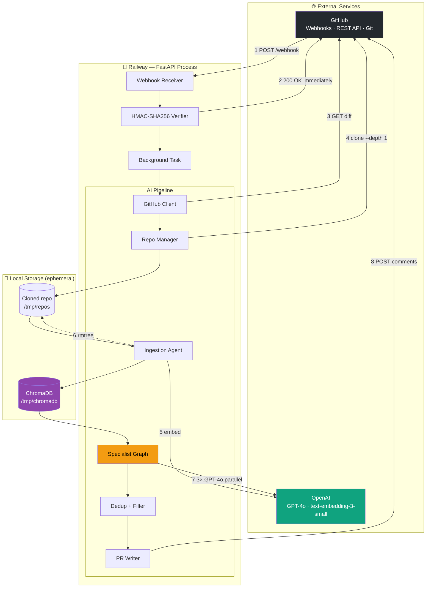
```mermaid
graph TB
    subgraph EXT["🌐 External Services"]
        GH["GitHub<br/>Webhooks · REST API · Git"]
        OAI["OpenAI<br/>GPT-4o · text-embedding-3-small"]
    end

    subgraph APP["🚂 Railway — FastAPI Process"]
        WH["Webhook Receiver"]
        SIG["HMAC-SHA256 Verifier"]
        BG["Background Task"]
        subgraph PIPE["AI Pipeline"]
            GC["GitHub Client"]
            RM["Repo Manager"]
            ING["Ingestion Agent"]
            SPEC["Specialist Graph"]
            FILT["Dedup + Filter"]
            PW["PR Writer"]
        end
    end

    subgraph STORE["💾 Local Storage (ephemeral)"]
        CH[("ChromaDB<br/>/tmp/chromadb")]
        FS[("Cloned repo<br/>/tmp/repos")]
    end

    GH -->|"1 POST /webhook"| WH
    WH --> SIG
    SIG -->|"2 200 OK immediately"| GH
    SIG --> BG
    BG --> GC
    GC -->|"3 GET diff"| GH
    GC --> RM
    RM -->|"4 clone --depth 1"| GH
    RM --> FS
    FS --> ING
    ING -->|"5 embed"| OAI
    ING --> CH
    ING -.->|"6 rmtree"| FS
    CH --> SPEC
    SPEC -->|"7 3× GPT-4o parallel"| OAI
    SPEC --> FILT
    FILT --> PW
    PW -->|"8 POST comments"| GH

    style GH fill:#24292e,color:#fff
    style OAI fill:#10a37f,color:#fff
    style SPEC fill:#f39c12,color:#000
    style CH fill:#8e44ad,color:#fff
```

---

## 2. Complete Request Sequence

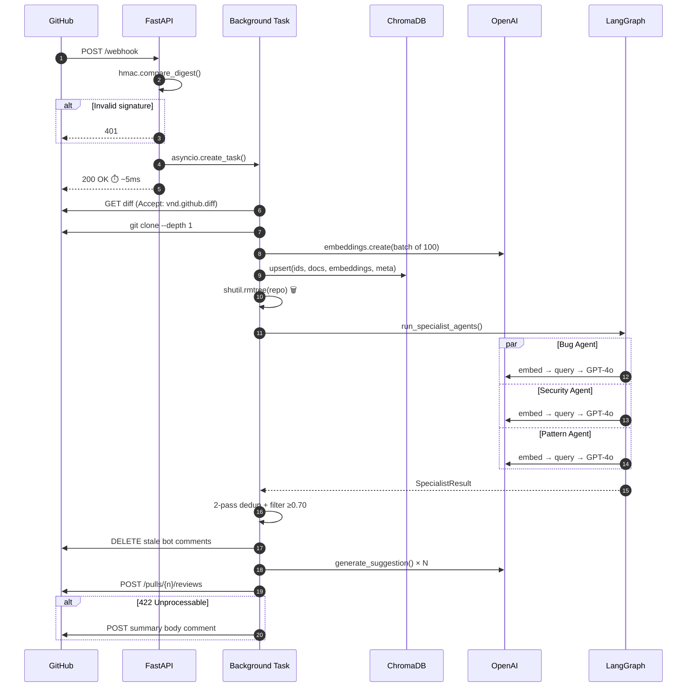
```mermaid
sequenceDiagram
    autonumber
    participant GH as GitHub
    participant FA as FastAPI
    participant BG as Background Task
    participant CD as ChromaDB
    participant OA as OpenAI
    participant LG as LangGraph

    GH->>FA: POST /webhook
    FA->>FA: hmac.compare_digest()
    alt Invalid signature
        FA-->>GH: 401
    end
    FA->>BG: asyncio.create_task()
    FA-->>GH: 200 OK ⏱️ ~5ms

    BG->>GH: GET diff (Accept: vnd.github.diff)
    BG->>GH: git clone --depth 1
    BG->>OA: embeddings.create(batch of 100)
    BG->>CD: upsert(ids, docs, embeddings, meta)
    BG->>BG: shutil.rmtree(repo) 🗑️

    BG->>LG: run_specialist_agents()
    par Bug Agent
        LG->>OA: embed → query → GPT-4o
    and Security Agent
        LG->>OA: embed → query → GPT-4o
    and Pattern Agent
        LG->>OA: embed → query → GPT-4o
    end
    LG-->>BG: SpecialistResult

    BG->>BG: 2-pass dedup + filter ≥0.70
    BG->>GH: DELETE stale bot comments
    BG->>OA: generate_suggestion() × N
    BG->>GH: POST /pulls/{n}/reviews
    alt 422 Unprocessable
        BG->>GH: POST summary body comment
    end
```

---

## 3. Authentication — Both Directions

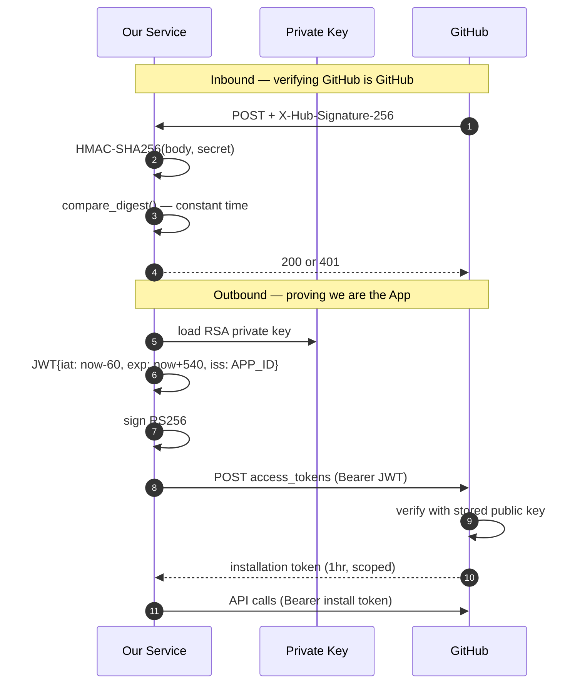
```mermaid
sequenceDiagram
    autonumber
    participant App as Our Service
    participant PK as Private Key
    participant GH as GitHub

    Note over App,GH: Inbound — verifying GitHub is GitHub
    GH->>App: POST + X-Hub-Signature-256
    App->>App: HMAC-SHA256(body, secret)
    App->>App: compare_digest() — constant time
    App-->>GH: 200 or 401

    Note over App,GH: Outbound — proving we are the App
    App->>PK: load RSA private key
    App->>App: JWT{iat: now-60, exp: now+540, iss: APP_ID}
    App->>App: sign RS256
    App->>GH: POST access_tokens (Bearer JWT)
    GH->>GH: verify with stored public key
    GH-->>App: installation token (1hr, scoped)
    App->>GH: API calls (Bearer install token)
```

---

## 4. LangGraph Agent Fan-Out

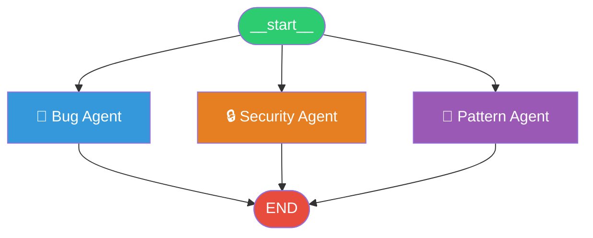
```mermaid
graph TB
    START(["__start__"])
    BUG["🐛 Bug Agent"]
    SEC["🔒 Security Agent"]
    PAT["🎨 Pattern Agent"]
    END(["END"])

    START --> BUG
    START --> SEC
    START --> PAT
    BUG --> END
    SEC --> END
    PAT --> END

    style START fill:#2ecc71,color:#fff
    style END fill:#e74c3c,color:#fff
    style BUG fill:#3498db,color:#fff
    style SEC fill:#e67e22,color:#fff
    style PAT fill:#9b59b6,color:#fff
```

---

## 5. Nested Parallelism Inside an Agent

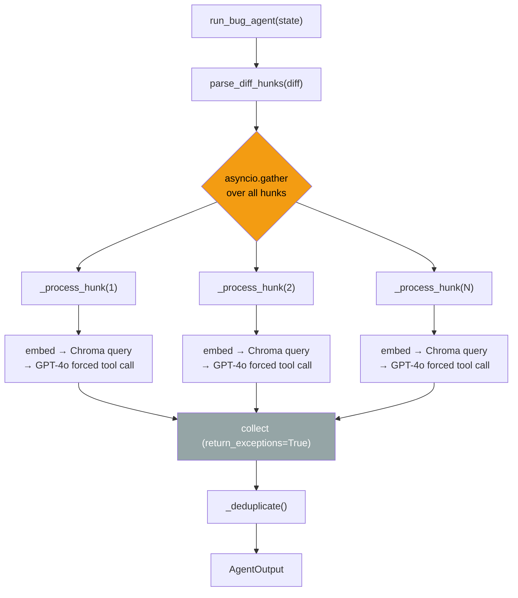
```mermaid
graph TB
    A["run_bug_agent(state)"] --> B["parse_diff_hunks(diff)"]
    B --> C{"asyncio.gather<br/>over all hunks"}
    C --> H1["_process_hunk(1)"]
    C --> H2["_process_hunk(2)"]
    C --> H3["_process_hunk(N)"]
    H1 --> R1["embed → Chroma query<br/>→ GPT-4o forced tool call"]
    H2 --> R2["embed → Chroma query<br/>→ GPT-4o forced tool call"]
    H3 --> R3["embed → Chroma query<br/>→ GPT-4o forced tool call"]
    R1 --> M["collect (return_exceptions=True)"]
    R2 --> M
    R3 --> M
    M --> D["_deduplicate()"]
    D --> O["AgentOutput"]

    style C fill:#f39c12,color:#000
    style M fill:#95a5a6,color:#fff
```

---

## 6. RAG Data Flow

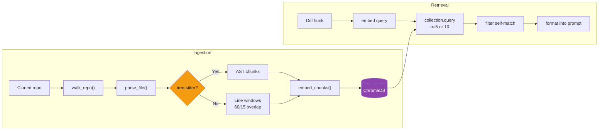
```mermaid
graph LR
    subgraph "Ingestion"
        A["Cloned repo"] --> B["walk_repo()"]
        B --> C["parse_file()"]
        C --> D{"tree-sitter?"}
        D -->|Yes| E["AST chunks"]
        D -->|No| F["Line windows<br/>60/15 overlap"]
        E --> G["embed_chunks()"]
        F --> G
        G --> H[("ChromaDB")]
    end
    subgraph "Retrieval"
        J["Diff hunk"] --> K["embed query"]
        K --> L["collection.query<br/>n=5 or 10"]
        H --> L
        L --> M["filter self-match"]
        M --> N["format into prompt"]
    end
    style H fill:#8e44ad,color:#fff
    style D fill:#f39c12,color:#000
```

---

## 7. Chunking Decision Tree

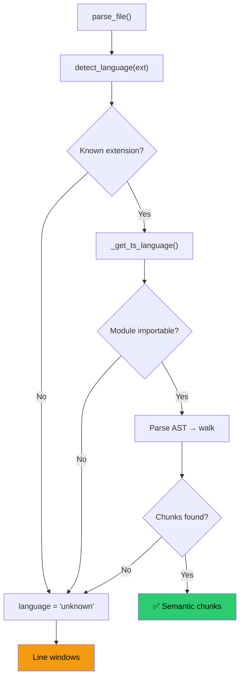
```mermaid
graph TD
    A["parse_file()"] --> B["detect_language(ext)"]
    B --> C{"Known extension?"}
    C -->|No| G["language = 'unknown'"]
    C -->|Yes| D["_get_ts_language()"]
    D --> E{"Module importable?"}
    E -->|No| G
    E -->|Yes| F["Parse AST → walk"]
    F --> H{"Chunks found?"}
    H -->|Yes| I["✅ Semantic chunks"]
    H -->|No| G
    G --> J["Line windows"]
    style I fill:#2ecc71,color:#000
    style J fill:#f39c12,color:#000
```

---

## 8. Diff Parser State Machine

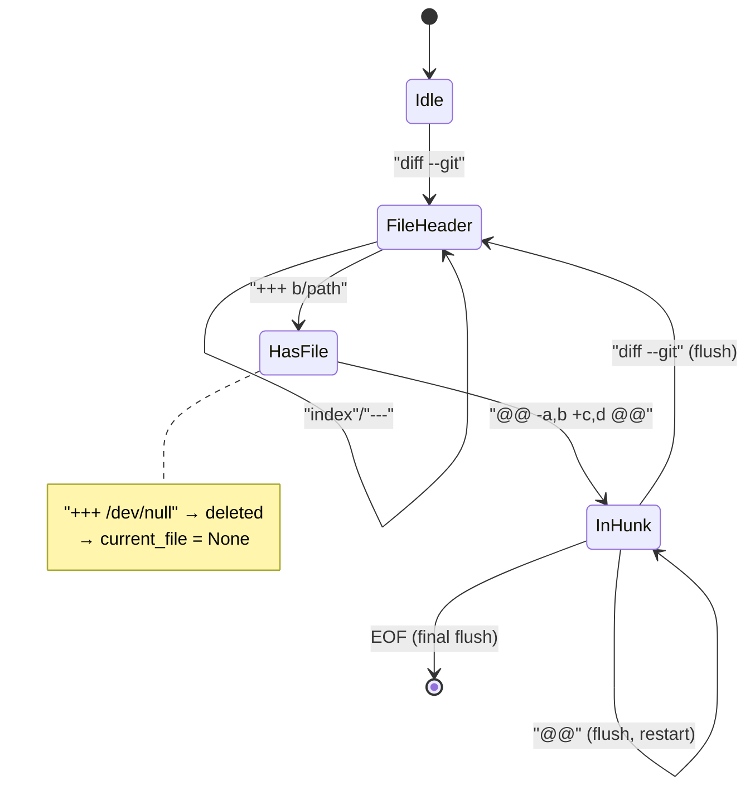
```mermaid
stateDiagram-v2
    [*] --> Idle
    Idle --> FileHeader: "diff --git"
    FileHeader --> FileHeader: "index"/"---"
    FileHeader --> HasFile: "+++ b/path"
    HasFile --> InHunk: "@@ -a,b +c,d @@"
    InHunk --> InHunk: +/-/context lines
    InHunk --> InHunk: "@@" (flush, restart)
    InHunk --> FileHeader: "diff --git" (flush)
    InHunk --> [*]: EOF (final flush)
    note right of HasFile
        "+++ /dev/null" → deleted
        → current_file = None
    end note
```

---

## 9. Error Handling / Degradation

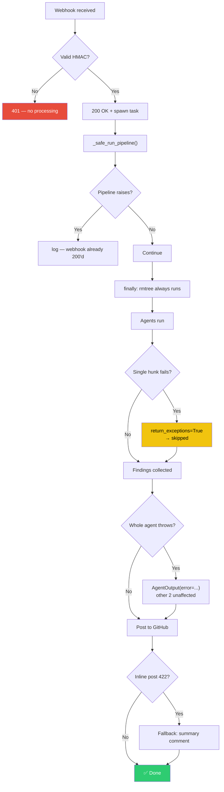
```mermaid
graph TB
    A["Webhook received"] --> B{"Valid HMAC?"}
    B -->|No| C["401 — no processing"]
    B -->|Yes| D["200 OK + spawn task"]
    D --> E["_safe_run_pipeline()"]
    E --> F{"Pipeline raises?"}
    F -->|Yes| G["log — webhook already 200'd"]
    F -->|No| H["Continue"]
    H --> J["finally: rmtree always runs"]
    J --> K["Agents run"]
    K --> L{"Single hunk fails?"}
    L -->|Yes| M["return_exceptions=True<br/>→ skipped"]
    L -->|No| N["Findings collected"]
    M --> N
    N --> O{"Whole agent throws?"}
    O -->|Yes| P["AgentOutput(error=...)<br/>other 2 unaffected"]
    O -->|No| Q["Post to GitHub"]
    P --> Q
    Q --> R{"Inline post 422?"}
    R -->|Yes| S["Fallback: summary comment"]
    R -->|No| T["✅ Done"]
    S --> T
    style C fill:#e74c3c,color:#fff
    style M fill:#f1c40f,color:#000
    style T fill:#2ecc71,color:#fff
```

---

## 10. Hallucination Prevention Layers

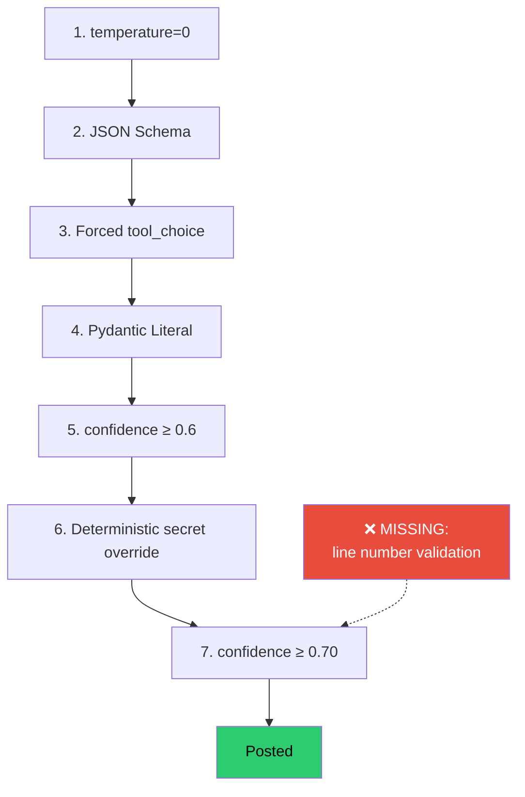
```mermaid
graph TD
    A["1. temperature=0"] --> B["2. JSON Schema"]
    B --> C["3. Forced tool_choice"]
    C --> D["4. Pydantic Literal"]
    D --> E["5. confidence ≥ 0.6"]
    E --> F["6. Deterministic secret override"]
    F --> G["7. confidence ≥ 0.70"]
    G --> H["Posted"]
    I["❌ MISSING:<br/>line number validation"] -.-> G
    style H fill:#2ecc71,color:#000
    style I fill:#e74c3c,color:#fff
```

---

## 11. Caching Layers

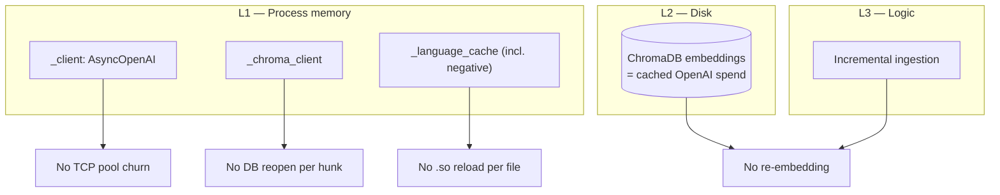
```mermaid
graph TB
    subgraph "L1 — Process memory"
        A["_client: AsyncOpenAI"]
        B["_chroma_client"]
        C["_language_cache (incl. negative)"]
    end
    subgraph "L2 — Disk"
        D[("ChromaDB embeddings<br/>= cached OpenAI spend")]
    end
    subgraph "L3 — Logic"
        E["Incremental ingestion"]
    end
    A --> F["No TCP pool churn"]
    B --> G["No DB reopen per hunk"]
    C --> H["No .so reload per file"]
    D --> I["No re-embedding"]
    E --> I
```

---

## 12. Deployment

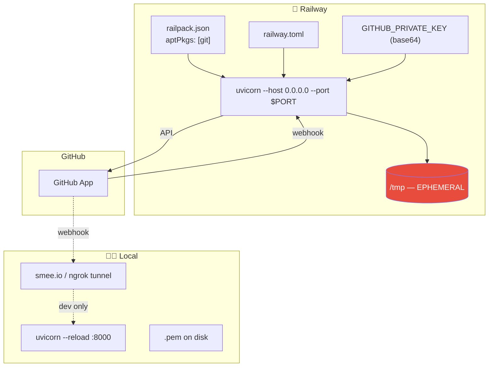
```mermaid
graph TB
    subgraph DEV["👨‍💻 Local"]
        L["uvicorn --reload :8000"]
        SM["smee.io / ngrok tunnel"]
        LP[".pem on disk"]
    end
    subgraph RW["🚂 Railway"]
        RP["railpack.json<br/>aptPkgs: [git]"]
        RT["railway.toml"]
        C["uvicorn --host 0.0.0.0 --port $PORT"]
        EV["GITHUB_PRIVATE_KEY (base64)"]
        TMP[("/tmp — EPHEMERAL")]
    end
    subgraph GH["GitHub"]
        APP["GitHub App"]
    end
    SM -.->|dev only| L
    APP -->|webhook| C
    APP -.->|webhook| SM
    RP --> C
    RT --> C
    EV --> C
    C --> TMP
    C -->|API| APP
    style TMP fill:#e74c3c,color:#fff
```

---

## 13. Scaling Architecture (Tier C+)

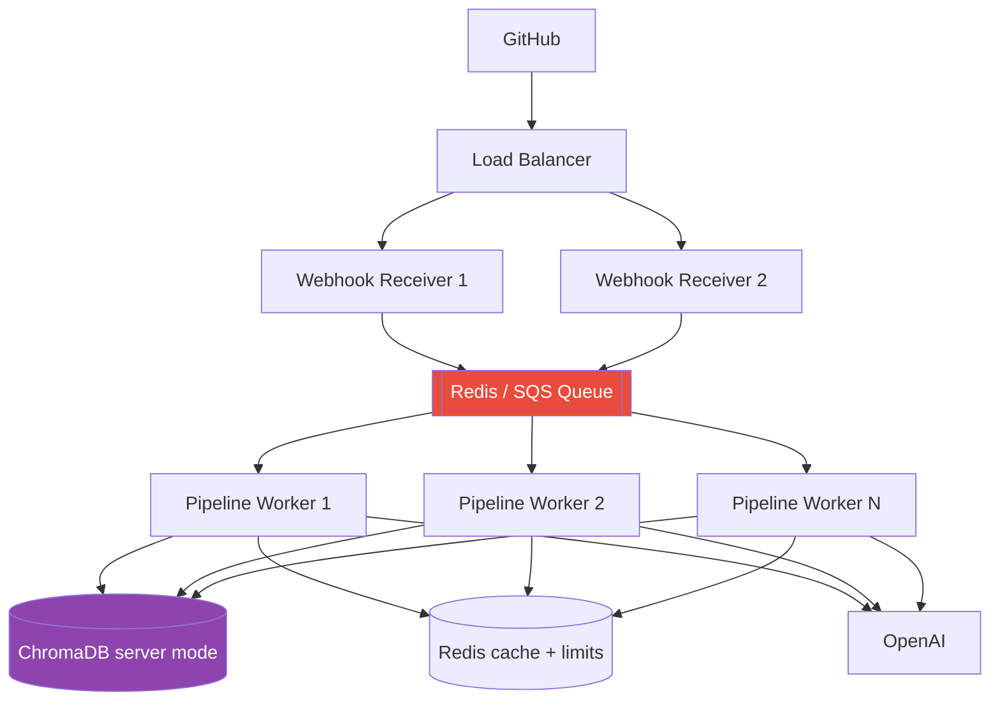
```mermaid
graph TB
    GH["GitHub"] --> LB["Load Balancer"]
    LB --> W1["Webhook Receiver 1"]
    LB --> W2["Webhook Receiver 2"]
    W1 --> Q[["Redis / SQS Queue"]]
    W2 --> Q
    Q --> P1["Pipeline Worker 1"]
    Q --> P2["Pipeline Worker 2"]
    Q --> P3["Pipeline Worker N"]
    P1 & P2 & P3 --> CH[("ChromaDB server mode")]
    P1 & P2 & P3 --> RD[("Redis cache + limits")]
    P1 & P2 & P3 --> OAI["OpenAI"]
    style Q fill:#e74c3c,color:#fff
    style CH fill:#8e44ad,color:#fff
```

---

## 14. Full-Scale Architecture (Tier D/E)

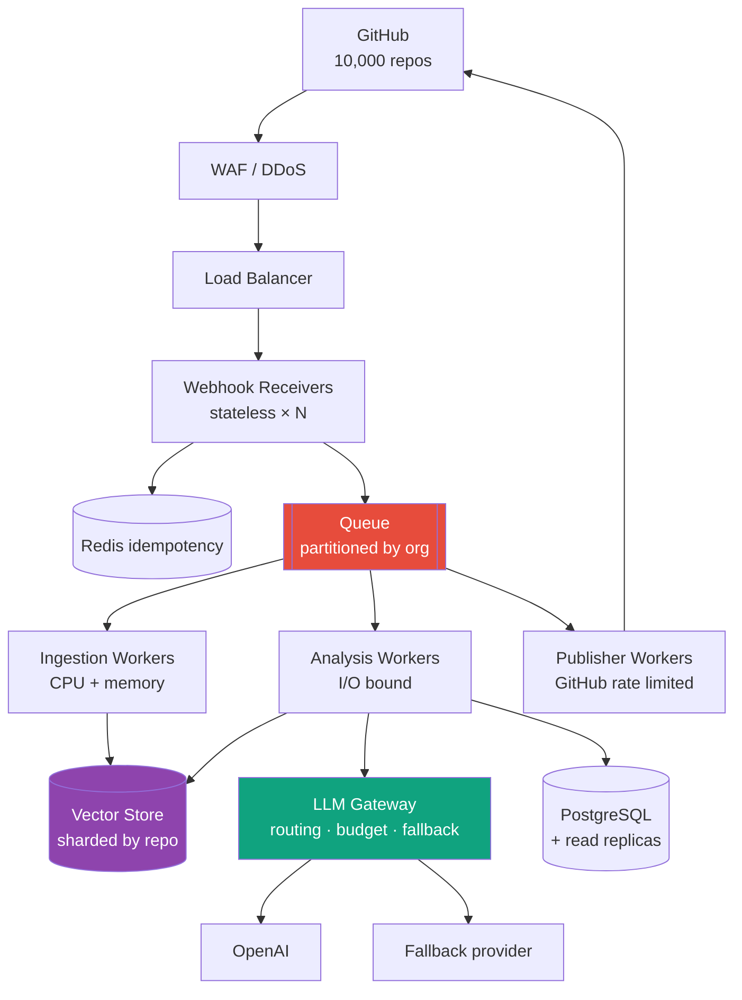
```mermaid
graph TB
    GH["GitHub<br/>10,000 repos"] --> WAF["WAF / DDoS"]
    WAF --> LB["Load Balancer"]
    LB --> W1["Webhook Receivers<br/>stateless × N"]
    W1 --> IDEM[("Redis idempotency")]
    W1 --> Q[["Queue<br/>partitioned by org"]]
    Q --> ING["Ingestion Workers<br/>CPU + memory"]
    Q --> ANA["Analysis Workers<br/>I/O bound"]
    Q --> PUB["Publisher Workers<br/>GitHub rate limited"]
    ING --> VS[("Vector Store<br/>sharded by repo")]
    ANA --> VS
    ANA --> LLM["LLM Gateway<br/>routing · budget · fallback"]
    LLM --> OAI["OpenAI"]
    LLM --> ALT["Fallback provider"]
    ANA --> PG[("PostgreSQL<br/>+ read replicas")]
    PUB --> GH
    style Q fill:#e74c3c,color:#fff
    style VS fill:#8e44ad,color:#fff
    style LLM fill:#10a37f,color:#fff
```

---

## 15. The Deletion Cascade

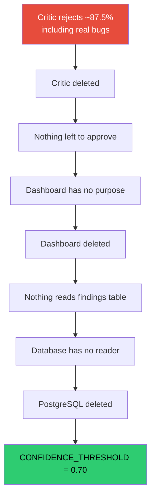
```mermaid
graph TD
    A["Critic rejects ~87.5%<br/>including real bugs"] --> B["Critic deleted"]
    B --> C["Nothing left to approve"]
    C --> D["Dashboard has no purpose"]
    D --> E["Dashboard deleted"]
    E --> F["Nothing reads findings table"]
    F --> G["Database has no reader"]
    G --> H["PostgreSQL deleted"]
    H --> I["CONFIDENCE_THRESHOLD = 0.70"]
    style A fill:#e74c3c,color:#fff
    style I fill:#2ecc71,color:#000
```

---

## 16. ChromaDB "ER" Diagram

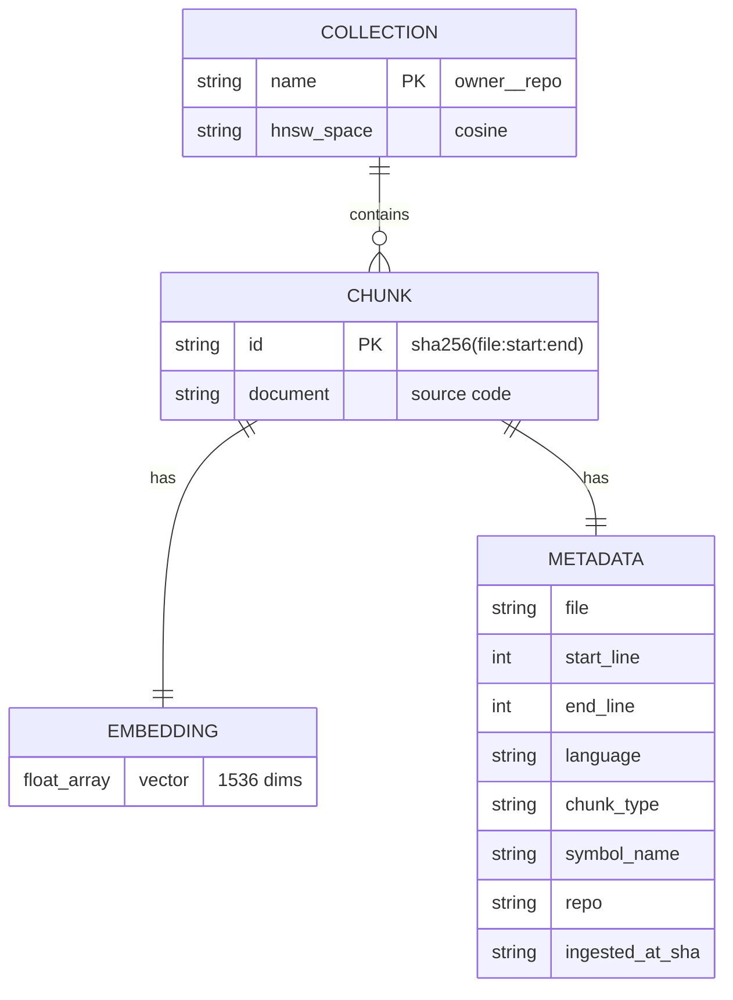
```mermaid
erDiagram
    COLLECTION ||--o{ CHUNK : contains
    CHUNK ||--|| EMBEDDING : has
    CHUNK ||--|| METADATA : has

    COLLECTION {
        string name PK "owner__repo"
        string hnsw_space "cosine"
    }
    CHUNK {
        string id PK "sha256(file:start:end)"
        string document "source code"
    }
    EMBEDDING {
        float_array vector "1536 dims"
    }
    METADATA {
        string file
        int start_line
        int end_line
        string language
        string chunk_type
        string symbol_name
        string repo
        string ingested_at_sha
    }
```

---

## 17. Deleted PostgreSQL Schema

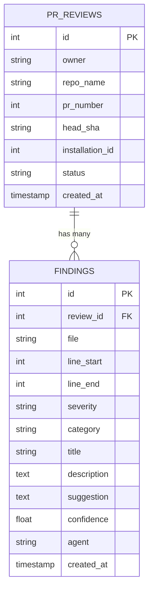
```mermaid
erDiagram
    PR_REVIEWS ||--o{ FINDINGS : "has many"
    PR_REVIEWS {
        int id PK
        string owner
        string repo_name
        int pr_number
        string head_sha
        int installation_id
        string status
        timestamp created_at
    }
    FINDINGS {
        int id PK
        int review_id FK
        string file
        int line_start
        int line_end
        string severity
        string category
        string title
        text description
        text suggestion
        float confidence
        string agent
        timestamp created_at
    }
```

---

## 18. Class Diagram

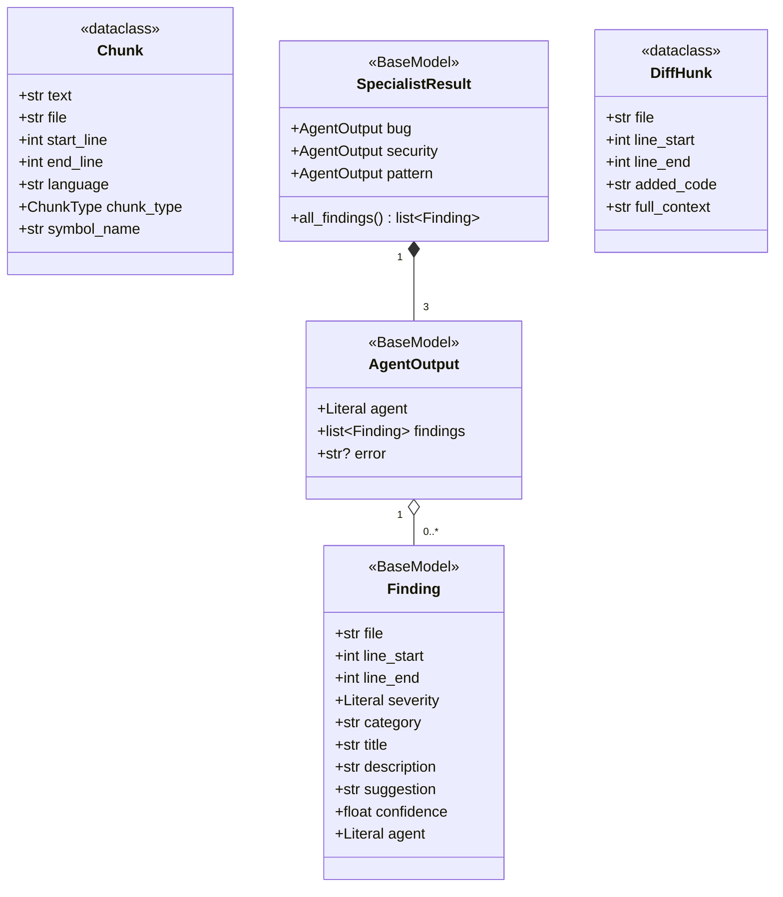
```mermaid
classDiagram
    class Chunk {
        <<dataclass>>
        +str text
        +str file
        +int start_line
        +int end_line
        +str language
        +ChunkType chunk_type
        +str symbol_name
    }
    class Finding {
        <<BaseModel>>
        +str file
        +int line_start
        +int line_end
        +Literal severity
        +str category
        +str title
        +str description
        +str suggestion
        +float confidence
        +Literal agent
    }
    class AgentOutput {
        <<BaseModel>>
        +Literal agent
        +list~Finding~ findings
        +str? error
    }
    class SpecialistResult {
        <<BaseModel>>
        +AgentOutput bug
        +AgentOutput security
        +AgentOutput pattern
        +all_findings() list~Finding~
    }
    class DiffHunk {
        <<dataclass>>
        +str file
        +int line_start
        +int line_end
        +str added_code
        +str full_context
    }
    SpecialistResult "1" *-- "3" AgentOutput
    AgentOutput "1" o-- "0..*" Finding
```

---

## 19. Module Dependency Graph

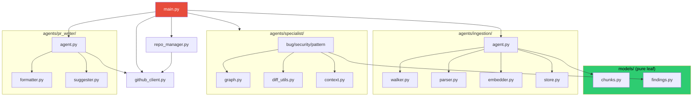
```mermaid
graph TD
    MAIN["main.py"]
    GC["github_client.py"]
    RM["repo_manager.py"]
    subgraph ING["agents/ingestion/"]
        IA["agent.py"]
        IW["walker.py"]
        IP["parser.py"]
        IE["embedder.py"]
        IS["store.py"]
    end
    subgraph SPEC["agents/specialist/"]
        SG["graph.py"]
        SD["diff_utils.py"]
        SC["context.py"]
        SB["bug/security/pattern"]
    end
    subgraph PW["agents/pr_writer/"]
        PA["agent.py"]
        PF["formatter.py"]
        PS["suggester.py"]
    end
    subgraph MOD["models/ (pure leaf)"]
        MC["chunks.py"]
        MF["findings.py"]
    end
    MAIN --> GC & RM & IA & SPEC & PA
    RM --> GC
    PA --> GC & PF & PS
    IA --> IW & IP & IE & IS
    SB --> SD & SC & SG
    IA --> MC
    SB --> MF
    style MAIN fill:#e74c3c,color:#fff
    style MOD fill:#2ecc71,color:#000
```

---

## 20. Async: Before vs After

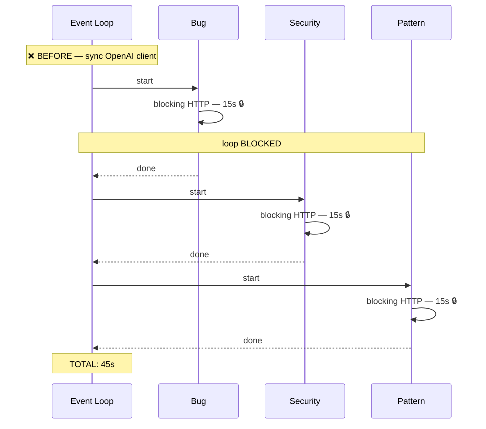
```mermaid
sequenceDiagram
    participant EL as Event Loop
    participant B as Bug
    participant S as Security
    participant P as Pattern
    Note over EL: ❌ BEFORE — sync OpenAI client
    EL->>B: start
    B->>B: blocking HTTP — 15s 🔒
    Note over EL,P: loop BLOCKED
    B-->>EL: done
    EL->>S: start
    S->>S: blocking HTTP — 15s 🔒
    S-->>EL: done
    EL->>P: start
    P->>P: blocking HTTP — 15s 🔒
    P-->>EL: done
    Note over EL: TOTAL: 45s
```

```mermaid
sequenceDiagram
    participant EL as Event Loop
    participant B as Bug
    participant S as Security
    participant P as Pattern
    Note over EL: ✅ AFTER — AsyncOpenAI
    EL->>B: start
    B->>B: await — yields ⏸️
    EL->>S: start
    S->>S: await — yields ⏸️
    EL->>P: start
    P->>P: await — yields ⏸️
    Note over EL,P: all three in flight
    B-->>EL: done (15s)
    S-->>EL: done (15s)
    P-->>EL: done (15s)
    Note over EL: TOTAL: ~15s
```

---

## 21. Roadmap Gantt

```mermaid
gantt
    dateFormat YYYY-MM-DD
    title Prioritised Roadmap
    section P0 Correctness
    Bot comment filter          :2026-08-01, 1d
    Stale chunk purge           :2026-08-02, 2d
    Line number validation      :2026-08-04, 3d
    Concurrency semaphore       :2026-08-07, 1d
    section P1 Operability
    Structured logging          :2026-08-10, 5d
    Unit test suite             :2026-08-15, 10d
    Persistent volume           :2026-08-25, 2d
    Retry with backoff          :2026-08-27, 3d
    section P2 Reliability
    Task queue migration        :2026-09-01, 14d
    Idempotency                 :2026-09-15, 3d
    Cost metering               :2026-09-18, 5d
    section P3 Measurement
    Feedback collection         :2026-10-01, 10d
    Evaluation suite            :2026-10-11, 10d
    Threshold calibration       :2026-10-21, 5d
```

---

## 22. Latency Breakdown

```mermaid
pie title Where the 30-90s goes
    "GPT-4o agents" : 60
    "Fix suggestions" : 15
    "Ingestion embeddings" : 12
    "Repo clone" : 8
    "Everything else" : 5
```

---

## 23. State Management Decision Tree (frontend theory)

```mermaid
graph TD
    A["Need shared state?"] -->|No| B["useState — local"]
    A -->|Yes| C["How many consumers?"]
    C -->|"2-3, nearby"| D["Lift state up"]
    C -->|"Many, deep"| E["Is it server data?"]
    E -->|Yes| F["React Query / SWR"]
    E -->|No| G["Changes often?"]
    G -->|Rarely| H["Context API"]
    G -->|Often| I["Zustand / Redux"]
    style F fill:#2ecc71,color:#000
```

---

## 24. HNSW Index Structure

```mermaid
graph TB
    subgraph L2["Layer 2 — sparse, long hops"]
        A2((A)) --- D2((D))
    end
    subgraph L1["Layer 1 — medium"]
        A1((A)) --- C1((C)) --- D1((D))
    end
    subgraph L0["Layer 0 — every node"]
        A0((A)) --- B0((B)) --- C0((C)) --- D0((D)) --- E0((E)) --- F0((F))
    end
    A2 -.descend.-> A1
    D2 -.descend.-> D1
    C1 -.descend.-> C0
    style L2 fill:#e74c3c,color:#fff
    style L0 fill:#2ecc71,color:#000
```

---

**See also:** [sequence-diagrams.md](sequence-diagrams.md) · [whiteboard-guide.md](whiteboard-guide.md)
